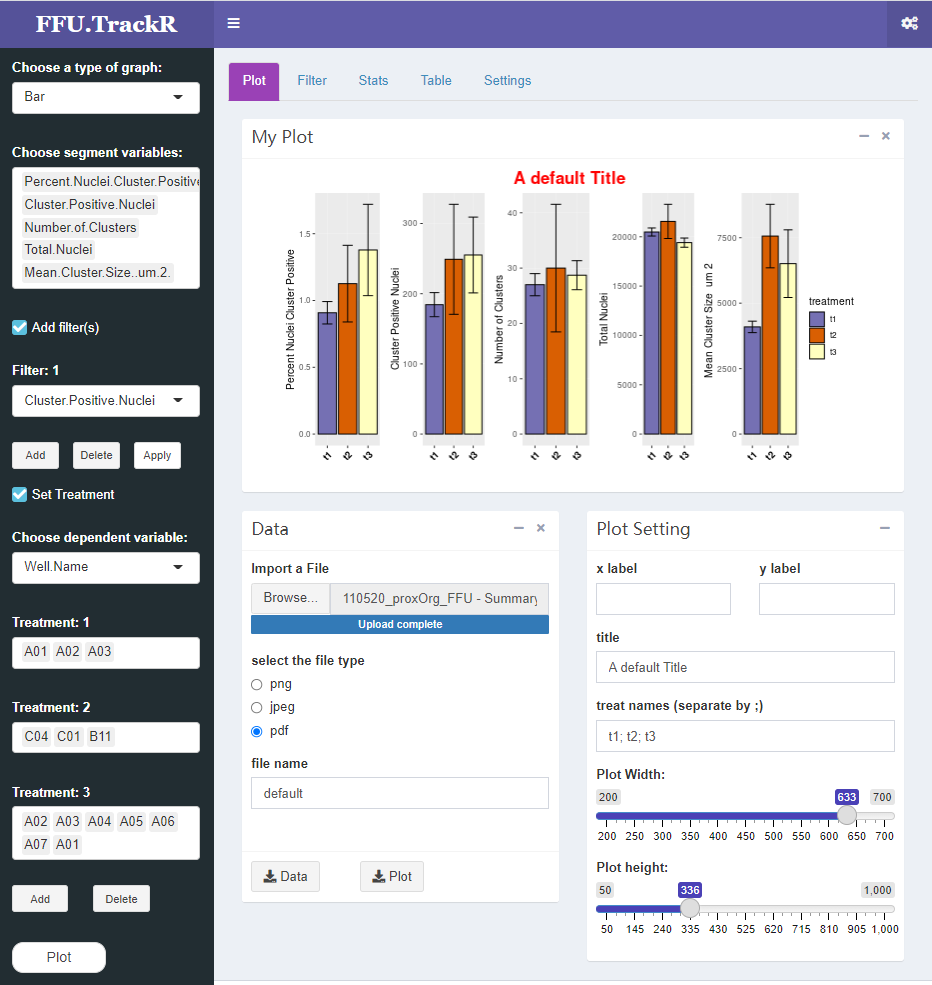
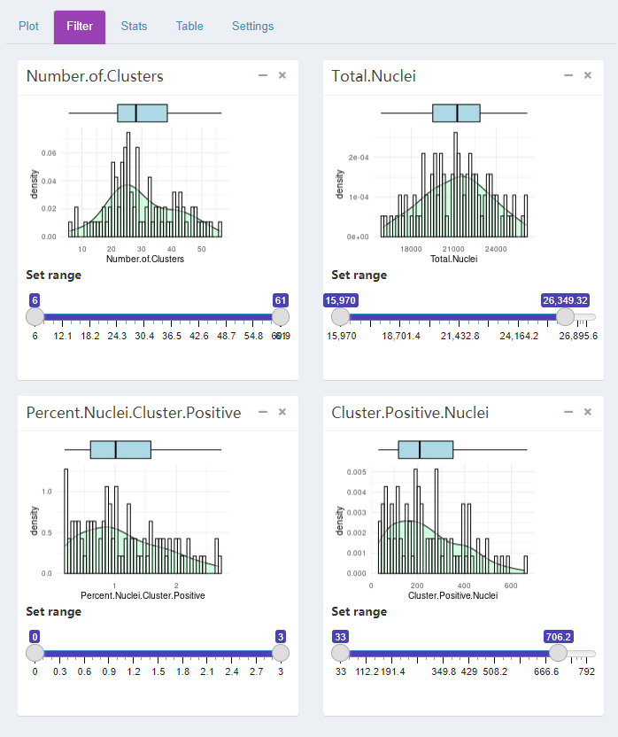

# FFUTrackR
On-going project (Croker Lab)

USE:
1. Install Rstudio
2. Install dependent packages
3. run "runApp()" in the directory

OR check out the online version at https://croker.shinyapps.io/ffutrackr/

Structure:
 - www: dir that contains all css files
 - ui.R: the user interface
 - server.R: the backend file

For questions (or suggestions and improvements), please contact us bcroker@ucsd.edu. This is a work in progress, so we welcome your feedback!
